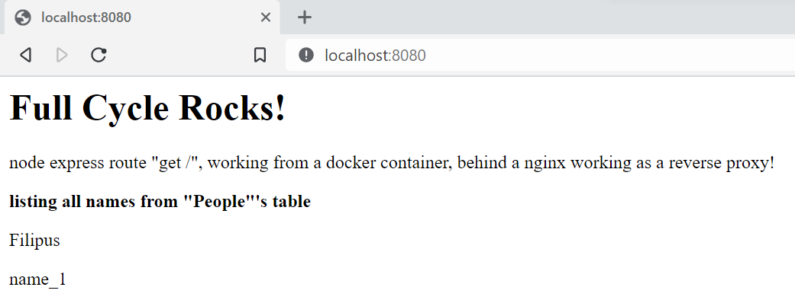

# docker challenge #2 (Nginx com Node.js)

Small app using Node.js, that inserts a register and lists a mysql database's table called "people", with a header "Full Cycle Rocks!", every time the "get /" endpoint is called.

to-do:
- [x] create a db script to create and populate table
- [ ] point the "/var/lib/mysql" to a docker volume
- [ ] add makefile: all, run, stop, clean, fclean

## how to run

### pre req:
- docker
- docker-compose

### run
inside the repo folder:
```bash
docker-compose -d
```

access localhost:8080, you should see:

